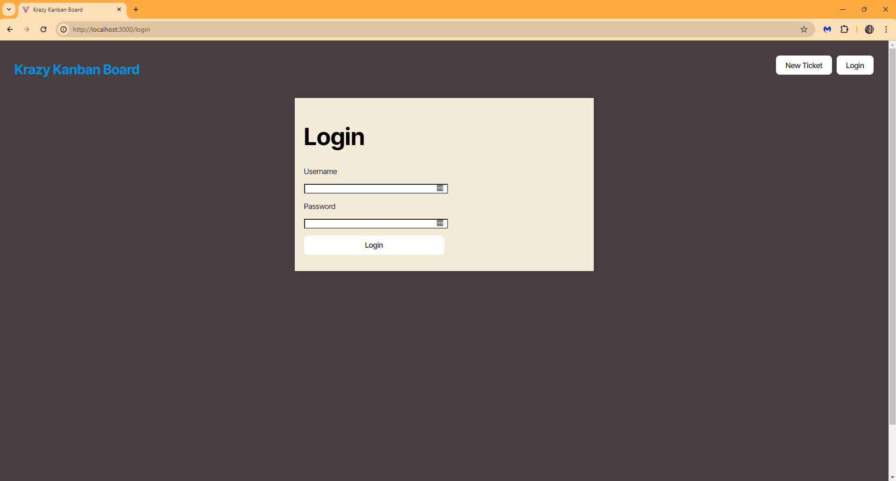

# Full-Stack React: Kanban Board

## Description

This project implements a Kanban board with authentication using JSON Web Tokens (JWT). The Kanban board allows users to manage their work tasks by sorting them into columns based on their status. The goal of this project is to secure the application by adding JWT-based authentication, allowing users to log in and access their tasks securely.

JWTs are used for verifying user identities and enabling authenticated API requests, allowing users to interact with the Kanban board's functionality. The project involves creating a login page where users input their username and password, and upon successful login, are redirected to the main board with JWT stored in the client's local storage for subsequent authenticated requests. If the user logs out or the session expires, the token is removed, and they are redirected back to the login page.

## Table of Contents

- [Usage](#usage)
- [Mock Up](#mock-up)
- [Instructions](#instructions)
- [Key Features](#key-features)
- [Technology Stack](#technology-stack)
- [Additional Resources](#additional-resources)

## Usage

To start the application, run the following command:

```bash
npm run start
```
This command will build the client-side application and start the server for the Kanban board.

## Mock-Up

The following images show the web application's appearance and functionality:





## Instructions

1. Create a .env file in the server directory with the following values:

* DB_USERNAME: Your database username.

* DB_PASSWORD: Your database password.

* JWT_SECRET: A secret key for the JWT (a random string).

2. Complete the authenticateToken method in server/src/middleware/auth.ts.

3. Implement the login method in server/src/routes/auth-routes.ts.

4. Add authentication to the API routes in server/src/routes/index.ts.

5. Complete the login method in client/src/api/authAPI.tsx.

6. Implement methods of the AuthService in client/src/utils/auth.ts.

7. Deploy the application using Render, following the [Deploy with Render and PostgreSQL guide.](https://coding-boot-camp.github.io/full-stack/render/deploy-with-render-and-postgresql)

## Key Features

* **Secure Login:** Users must authenticate with a username and password using JWT to access the Kanban board.

* **JWT Authentication:** The application uses JWT to authenticate requests and store the token in localStorage for session management.

* **Main Kanban Board:** Once logged in, users are redirected to the main board, where they can view, add, and manage tasks in columns based on their status.

* **Session Expiry:** The application will automatically invalidate the JWT after a period of inactivity, requiring the user to log in again.

## Technology Stack

This project relies on the following tools and technologies:

* **React:** Used to build the client-side user interface for the Kanban board.

* **Node.js:** The server is built using Node.js to handle authentication, API routes, and task management.

* **Express:** A web server framework used to handle HTTP requests and API routes.

* **PostgreSQL:** The database used to store user information and tasks.

* **JWT (JSON Web Tokens):** Used to securely authenticate users and manage their session.

## Additional Resources

* The URL of the deployed application: [Render Deployment](https://kanban-board-1-rluo.onrender.com)

* The URL of the GitHub repository: [GitHub Repository](https://github.com/gilmerperez/kanban-board)

* Learn more about JWT and how it works: [JWT.io](https://jwt.io/)

* Explore the full guide for deploying with Render: [Deploy with Render and PostgreSQL](https://coding-boot-camp.github.io/full-stack/render/deploy-with-render-and-postgresql)

* Render Documentation: [Setting Environment Variables](https://docs.render.com/configure-environment-variables)

* Download Insomnia request collection for testing: [Insomnia_M14_Challenge.zip](https://static.bc-edx.com/coding/software-dev/14-Full-Stack-React/assets/Insomnia_M14_Challenge.zip)